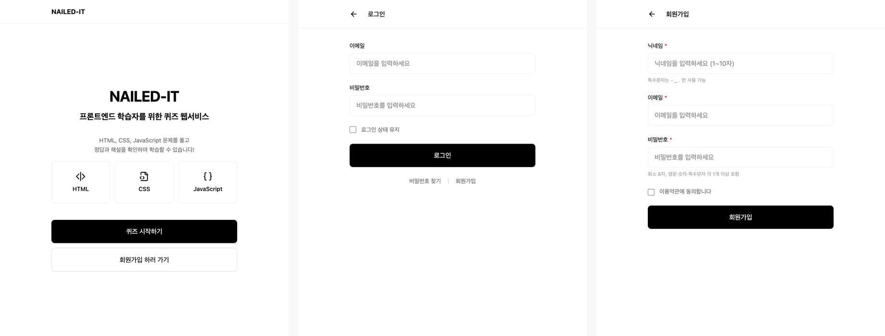
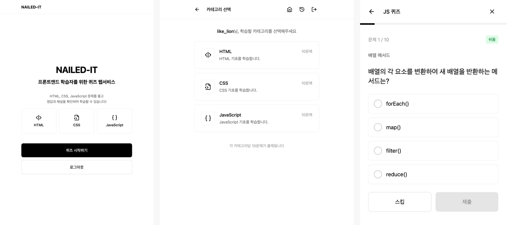
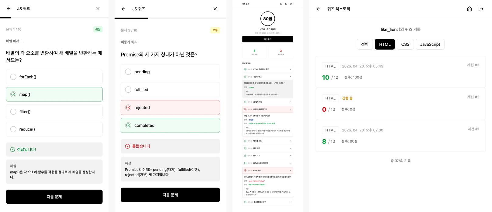
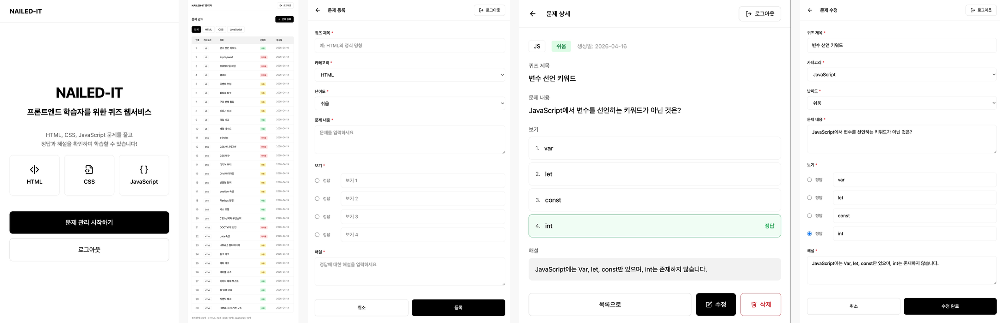

<div align="center">


[](https://git.io/typing-svg)

---


</div>

<br/>

## 📌 프로젝트 개요

**NAILED-IT**은 프론트엔드 기초를 다지고 싶은 학습자를 위한 퀴즈 웹 애플리케이션입니다.
HTML, CSS, JavaScript 핵심 개념을 객관식 퀴즈로 풀어보고, 즉시 정답과 해설을 확인할 수 있습니다.
관리자가 문제를 직접 등록·수정·삭제하고, 일반 사용자는 카테고리별 퀴즈를 풀며 학습 히스토리를 쌓아가는 구조입니다.

| 구분           | 내용                                                         |
| -------------- | ------------------------------------------------------------ |
| 📚 학습 플랫폼 | HTML, CSS, JavaScript 개념을 퀴즈로 학습하는 웹 애플리케이션 |
| 🎯 타겟 대상   | 프론트엔드 기초를 다지고 싶은 학습자                         |
| 🙋 사용자 경험 | 카테고리별 퀴즈 풀이, 즉시 피드백, 히스토리 기록             |
| 🔧 관리자 구조 | 문제 등록·수정·삭제, 카테고리 관리                           |

<br/>

## ✨ 주요 기능

- 🔐 로그인 상태에 따른 기능 제한

### 🙋 사용자 (USER)

| 기능          | 설명                                                      |
| ------------- | --------------------------------------------------------- |
| 홈 화면       | 서비스 소개, 카테고리 미리보기, 퀴즈 시작 / 회원가입 버튼 |
| 회원가입      | 닉네임·이메일·비밀번호 입력, 이용약관 동의                |
| 로그인        | 이메일·비밀번호 입력, 로그인 상태 유지 체크박스           |
| 카테고리 선택 | HTML / CSS / JavaScript 중 1개 선택                       |
| 퀴즈 풀이     | 객관식 4지선다 10문제, 스킵 기능, 진행률 표시             |
| 즉시 피드백   | 제출 즉시 정답·오답 표시 및 해설 확인                     |
| 결과 확인     | 총점, 맞은 문제 수, 문제별 정답·해설 확인                 |
| 히스토리      | 자신의 퀴즈 풀이 기록 전체 열람                           |

### 🔧 관리자 (ADMIN)

| 기능          | 설명                                              |
| ------------- | ------------------------------------------------- |
| 관리자 로그인 | 미리 지정된 관리자 정보로만 로그인 가능           |
| 문제 관리     | 전체 문제 목록 조회 (번호·카테고리·난이도·생성일) |
| 문제 등록     | 카테고리·제목·문제 내용·보기 4개·정답·해설 입력   |
| 문제 상세     | 등록된 문제 상세 정보 조회                        |
| 수정 & 삭제   | 기존 문제 수정 및 삭제                            |

<br/>

## 📸 스크린샷

### 공통 — 홈 / 로그인 / 회원가입



### 사용자 — 홈(로그인 후) / 카테고리 선택 / 퀴즈 풀이



### 사용자 — 즉시 피드백 / 오답 처리 / 결과 / 히스토리



### 관리자 — 홈 / 문제 목록 / 문제 등록 / 문제 상세 / 문제 수정



> 📍 스크린샷은 실제 배포 환경 기준입니다.

<br/>

## 🛠 기술 스택 및 생산성 도구

<div align="center">

<h3>Frontend</h3>


<h3>Deploy & API</h3>


<h3>Tools</h3>


</div>

<br/>

## 📁 Project Structure

```plaintext
NAILED-IT/
├── index.html                  # 서비스 소개 및 시작 화면
├── pages/                      # HTML 페이지
│   ├── login.html              # 로그인
│   ├── signup.html             # 회원가입
│   ├── category.html           # 카테고리 선택
│   ├── quiz.html               # 퀴즈 풀이
│   ├── result.html             # 퀴즈 결과
│   ├── history.html            # 히스토리
│   └── admin/                  # 관리자 페이지
│       ├── quiz-list.html
│       ├── quiz-form.html
│       ├── quiz-edit.html
│       └── quiz-detail.html
│
├── src/
│   ├── components/             # 공통 UI 컴포넌트
│   │   ├── header.js           # 페이지 헤더 컴포넌트
│   │   └── icon.js             # SVG 아이콘 컴포넌트
│   │
│   ├── pages/                  # 페이지별 JS 로직
│   │   ├── index.js
│   │   ├── login.js
│   │   ├── signup.js
│   │   ├── category.js
│   │   ├── quiz.js
│   │   ├── result.js
│   │   ├── history.js
│   │   └── admin/
│   │       ├── quiz-list.js
│   │       ├── quiz-form.js
│   │       ├── quiz-edit.js
│   │       └── quiz-detail.js
│   │
│   ├── api.js                  # API 호출 함수 모음
│   ├── main.js                 # Tailwind CSS 진입점
│   └── style.css               # Tailwind CSS
│
├── images/
│   ├── kys.png                 # 개발자 프로필 이미지
│   └── screenshots/            # README 스크린샷
│
├── docs/                       # 개발 문서
│   ├── API_GUIDE.md            # API 사용 가이드
│   └── NAILED_IT_API.md        # API 명세
│
├── package.json
└── vite.config.js
```

<br/>

## 💻 시작하기

프로젝트를 로컬 환경에서 실행하려면 아래 단계를 따라주세요.

```bash
# 1. 저장소 클론
git clone https://github.com/FRONTENDBOOTCAMP-17th/nailed-it.git

# 2. 폴더 이동
cd nailed-it

# 3. 의존성 설치
npm install

# 4. 로컬 서버 실행
npm run dev
```

<br/>

## 🔗 배포 URL

> [NAILED-IT](https://nailed-it-kappa.vercel.app/)

<br/>

## 🗺 향후 발전 전략

| 기능                | 설명                                                             |
| ------------------- | ---------------------------------------------------------------- |
| 오답노트            | 틀린 문제만 추려서 다시 풀 수 있는 기능                          |
| 랜덤 문제 출제      | 카테고리 고정 없이 랜덤으로 문제를 출제하는 모드                 |
| 난이도 기반 분류    | 쉬운 문제와 어려운 문제를 난이도별로 분류하여 제공               |
| 커뮤니티 게시판     | 익명 게시판 및 댓글 기능 (본인 댓글 삭제, 관리자 전체 삭제 권한) |
| React 카테고리 추가 | React 학습 후 React 관련 퀴즈 카테고리 추가 예정                 |

<br/>

## 👩‍💻 개발자

|                                              |
| :--------------------------------------------------------------------------------: |
|                                     **김연수**                                     |
|                               FRONTENDBOOTCAMP-17th                                |
| Designed and Developed with 🖤 by [**Kim Yeon-soo**](https://github.com/harikim02) |

<br/>

<div align="center">


</div>
