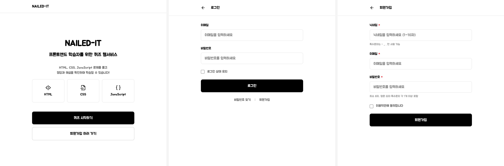
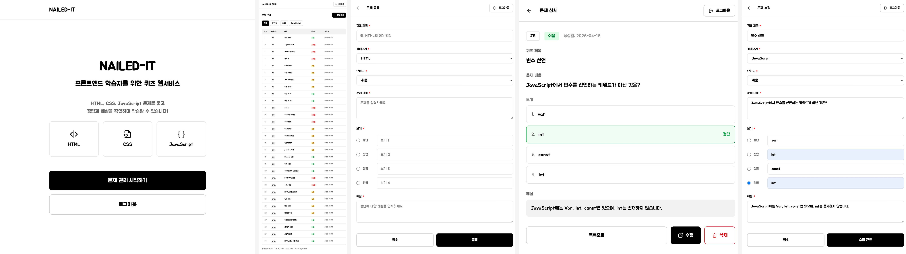
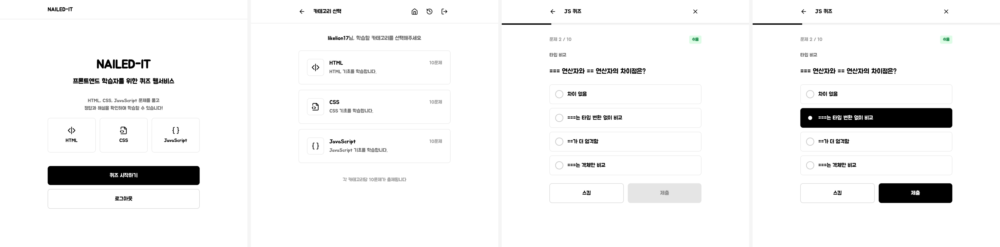
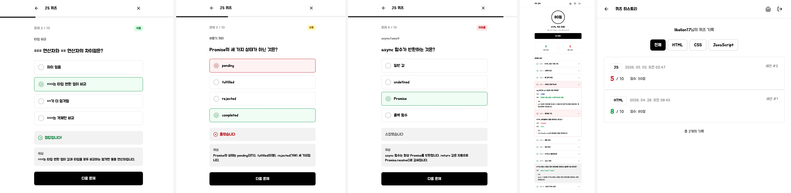

<div align="center">


[](https://git.io/typing-svg)

<br/>

<div align="center">

### 🚀 지금 바로 사용해보기

⬇️

[](https://nailed-it-kappa.vercel.app/)

</div>

<br/>

---


</div>

<br/><br/>

## 📌 Project Overview (프로젝트 개요)

**NAILED-IT**은 프론트엔드 기초를 다지고 싶은 학습자를 위한 퀴즈 웹 애플리케이션입니다.
HTML, CSS, JavaScript 핵심 개념을 객관식 퀴즈로 풀어보고, 즉시 정답과 해설을 확인할 수 있습니다.
관리자가 문제를 직접 등록·수정·삭제하고, 일반 사용자는 카테고리별 퀴즈를 풀며 학습 히스토리를 쌓아가는 구조입니다.

| 구분           | 내용                                                           |
| -------------- | -------------------------------------------------------------- |
| 📚 학습 플랫폼 | HTML, CSS, JavaScript 개념을 퀴즈로 학습하는 웹 애플리케이션   |
| 💡 핵심 가치   | 프론트엔드 핵심 개념의 퀴즈화를 통한 직관적인 학습 경험 제공   |
| 🎯 타겟 대상   | 프론트엔드 기초를 학습하는 입문자 (사용자 친화적 UI/UX 최적화) |
| 🙋 사용자 경험 | 카테고리별 퀴즈 풀이, 즉시 피드백, 히스토리 기록               |
| 🔧 관리자 구조 | 문제 등록·수정·삭제, 카테고리 관리                             |

<br/>

## ✨ Features (주요 기능)

- 🔐 로그인 상태에 따른 기능 제한

### 🙋 USER (사용자)

| 기능          | 설명                                                                                |
| ------------- | ----------------------------------------------------------------------------------- |
| 홈 화면       | 서비스 소개, 카테고리 미리보기, 퀴즈 시작 / 회원가입 버튼                           |
| 회원가입      | 닉네임·이메일·비밀번호 입력, 이용약관 동의                                          |
| 로그인        | 이메일·비밀번호 입력, 로그인 상태 유지 체크박스                                     |
| 카테고리 선택 | HTML / CSS / JavaScript 중 1개 선택                                                 |
| 퀴즈 풀이     | 객관식 4지선다 10문제, 스킵 기능, 진행률 표시                                       |
| 즉시 피드백   | 제출 즉시 정답·오답 표시 및 해설 확인                                               |
| 결과 확인     | 총점, 맞은 문제 수, 문제별 정답·해설 확인                                           |
| 히스토리      | 자신의 퀴즈 풀이 기록 전체 열람 (10문제 완료 시에만 자동 저장, 중도 포기 방지 설계) |

### 🔧 ADMIN (관리자)

| 기능          | 설명                                              |
| ------------- | ------------------------------------------------- |
| 관리자 로그인 | 미리 지정된 관리자 정보로만 로그인 가능           |
| 문제 관리     | 전체 문제 목록 조회 (번호·카테고리·난이도·생성일) |
| 문제 등록     | 카테고리·제목·문제 내용·보기 4개·정답·해설 입력   |
| 문제 상세     | 등록된 문제 상세 정보 조회                        |
| 수정 & 삭제   | 기존 문제 수정 및 삭제                            |

<br/>

## 📸 Screenshots (스크린샷)

### 공통 — 홈 / 로그인 / 회원가입



### 관리자 — 홈 / 문제 목록 / 문제 등록 / 문제 상세 / 문제 수정



### 사용자 — 홈(로그인 후) / 카테고리 선택 / 퀴즈 풀이 과정



### 사용자 — 즉시 피드백 (정답, 오답, 스킵) / 결과 / 히스토리



> 📍 스크린샷은 실제 배포 환경 기준입니다.

<br/>

## 🌐 How to Use (사용 방법)

### PC, 태블릿, 모바일 어디서든 링크 하나로 바로 이용할 수 있습니다.

1. **사이트 접속** — [nailed-it-kappa.vercel.app](https://nailed-it-kappa.vercel.app/) 으로 접속
2. **회원가입** — 닉네임 · 이메일 · 비밀번호 입력 후 이용약관 동의 체크 후 회원가입
3. **로그인** — 이메일 · 비밀번호 입력 후 로그인 (로그인 상태 유지 선택 가능)
4. **카테고리 선택** — HTML / CSS / JavaScript 중 1개 선택
5. **퀴즈 풀기** — 4지 선다 10문제 풀이 (스킵 가능)
6. **결과 확인** — 즉시 피드백 및 히스토리 자동 저장

<br/>

## 🛠 Tech Stack (기술 스택)

<div align="center">

<h3>Frontend</h3>


<h3>Deploy & API</h3>


<h3>Tools</h3>


</div>

<br/>

| 구분               | 기술                    | 선택 이유                   |
| ------------------ | ----------------------- | --------------------------- |
| Frontend           | Vanilla JS + Vite       | 빠른 빌드와 개발 서버 제공  |
| Styling            | Tailwind CSS            | 유틸리티 기반 빠른 UI 구현  |
| API & Architecture | REST API + Role-based   | ADMIN · USER 역할 분리 구조 |
| 배포               | Vercel + GitHub Actions | 자동 배포 연동              |

<br/>

## 📁 Project Structure (프로젝트 구조)

```plaintext
NAILED-IT/
├── public/
│   └── favicon.png             # 파비콘 - 로고 추가
│
├── index.html                  # 서비스 소개 및 시작 화면
├── pages/                      # HTML 페이지
│   ├── login.html              # 로그인
│   ├── signup.html             # 회원가입
│   ├── category.html           # 카테고리 선택
│   ├── quiz.html               # 퀴즈 풀이
│   ├── result.html             # 퀴즈 결과
│   ├── history.html            # 히스토리
│   └── admin/                  # 관리자 페이지
│       ├── quiz-list.html      # 문제 목록
│       ├── quiz-form.html      # 문제 등록
│       ├── quiz-edit.html      # 문제 수정
│       └── quiz-detail.html    # 문제 상세
│
├── src/
│   ├── components/             # 공통 UI 컴포넌트
│   │   ├── header.js           # 페이지 헤더 컴포넌트
│   │   └── icon.js             # SVG 아이콘 컴포넌트
│   │
│   ├── pages/                  # 유저 페이지 JS 로직
│   │   ├── index.js
│   │   ├── login.js
│   │   ├── signup.js
│   │   ├── category.js
│   │   ├── quiz.js
│   │   ├── result.js
│   │   ├── history.js
│   │   └── admin/              # 관리자 페이지 JS 로직
│   │       ├── quiz-list.js
│   │       ├── quiz-form.js
│   │       ├── quiz-edit.js
│   │       └── quiz-detail.js
│   │
│   ├── api.js                  # API 호출 함수 모음
│   ├── main.js                 # Tailwind CSS 진입점
│   └── style.css               # Tailwind CSS
│
├── images/
│   ├── kys.png                 # 개발자 프로필 이미지
│   └── screenshots/            # README 스크린샷
│
├── docs/                       # 개발 문서
│   ├── NAILED_IT_API.md              # API 요구사항 명세
│   ├── API_GUIDE.md                  # API 사용 가이드
│   ├── NAILED_IT_SPEC.md             # API 스펙 (엔드포인트 · 요청/응답 · 에러코드)
│   ├── code-review.md                # 초기 코드 리뷰 (2026-04-14)
│   ├── refactoring-guide.md          # 코드 리뷰 기반 리팩토링 가이드
│   ├── js-structure-guide.md         # JS 파일 구조화 가이드 (폴더별 역할 및 import/export)
│   ├── vite-setup-guide.md           # Vite + Tailwind CSS 프로젝트 설정 가이드
│   ├── 2026-04-15-code-review.md     # 4/15 코드 리뷰
│   ├── 2026-04-15-fix-guide.md       # 4/15 코드 리뷰 해결 가이드
│   ├── 2026-04-16-code-review.md     # 4/16 코드 리뷰
│   └── 2026-04-16-fix-guide.md       # 4/16 코드 리뷰 해결 가이드
│
├── package.json
└── vite.config.js
```

<br/>

## 🧠 Development Log (개발 과정)

### 머지 충돌 해결 & 커밋 규칙

머지 과정에서 발생한 충돌을 직접 해결하며 Git 협업 흐름을 이해했습니다.
Conventional Commits 규칙을 적용하여 커밋 메시지의 일관성을 유지했습니다.

> 사용 규칙

| 타입       | 사용 시점                              |
| ---------- | -------------------------------------- |
| `feat`     | 새로운 기능 추가                       |
| `fix`      | 버그 수정                              |
| `refactor` | 코드 구조 개선 (기능 변화 없음)        |
| `style`    | 코드 스타일 변경 (포맷팅, 세미콜론 등) |
| `docs`     | 문서 수정 (README, 주석 등)            |
| `test`     | 테스트 코드 추가/수정                  |
| `chore`    | 설정, 패키지, 빌드 관련 기타 작업      |

### 피그마 학습 및 적용

피그마를 처음 사용하여 전자책(UX/UI 디자이너를 위한 실무 피그마)을 통해 개념을 보완하고, 실습 중심으로 학습하며 프로젝트 UI 설계에 적용했습니다.

<br/>

## 📈 Future Plans (향후 발전 전략)

| 기능                | 설명                                                             |
| ------------------- | ---------------------------------------------------------------- |
| 오답노트            | 틀린 문제만 추려서 다시 풀 수 있는 기능                          |
| 랜덤 문제 출제      | 카테고리 고정 없이 랜덤으로 문제를 출제하는 모드                 |
| 난이도 기반 분류    | 쉬운 문제와 어려운 문제를 난이도별로 분류하여 제공               |
| 커뮤니티 게시판     | 익명 게시판 및 댓글 기능 (본인 댓글 삭제, 관리자 전체 삭제 권한) |
| React 카테고리 추가 | React 학습 후 React 관련 퀴즈 카테고리 추가 예정                 |

<br/>

## 🔗 Project Links (프로젝트 링크)

| 구분             | 링크                                                                                         |
| ---------------- | -------------------------------------------------------------------------------------------- |
| 🚀 배포 (Vercel) | [nailed-it-kappa.vercel.app](https://nailed-it-kappa.vercel.app/)                            |
| 💻 GitHub        | [FRONTENDBOOTCAMP-17th/nailed-it](https://github.com/FRONTENDBOOTCAMP-17th/nailed-it)        |
| 🔌 API 문서      | [fullstackfamily.com/nailed-it/api-docs](https://www.fullstackfamily.com/nailed-it/api-docs) |

<br/>

## 👩‍💻 Junior Developer (주니어 개발자)

|                                      |
| :------------------------------------------------------------------------: |
| Designed and Developed with 🖤 by [**김연수**](https://github.com/harilog) |
|                           FRONTENDBOOTCAMP-17th                            |

<br/>

## 📜 License

© 2026 Kim Yeon-soo. All rights reserved.<br/>
본 프로젝트의 저작권은 김연수에게 있으며, 무단 복제 및 재배포를 금지합니다.

<br/>

<div align="center">


</div>
